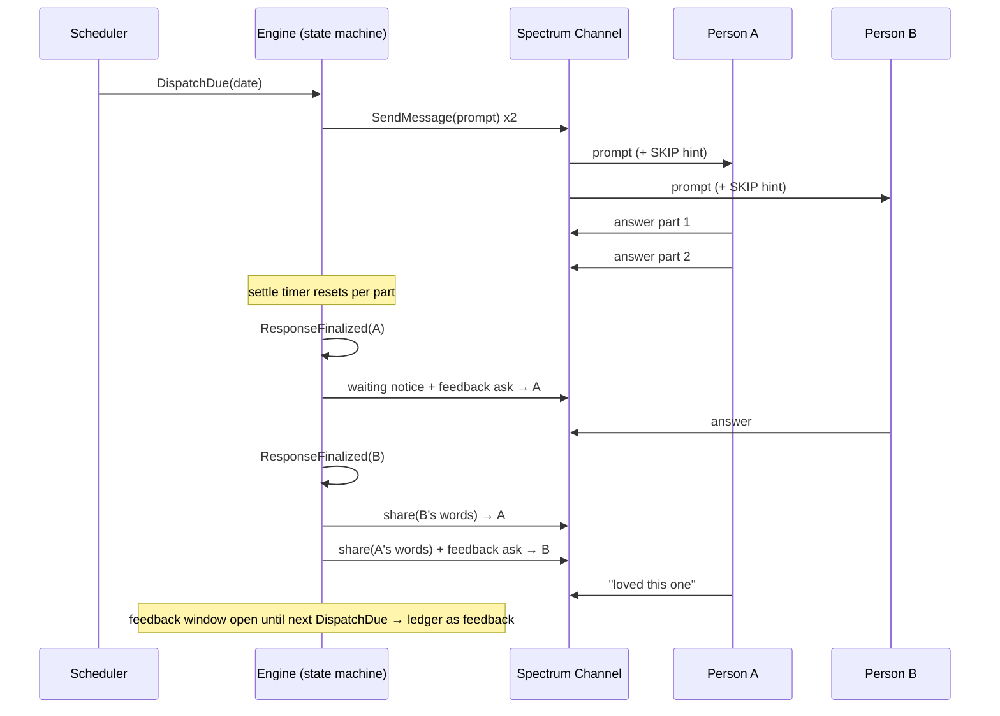
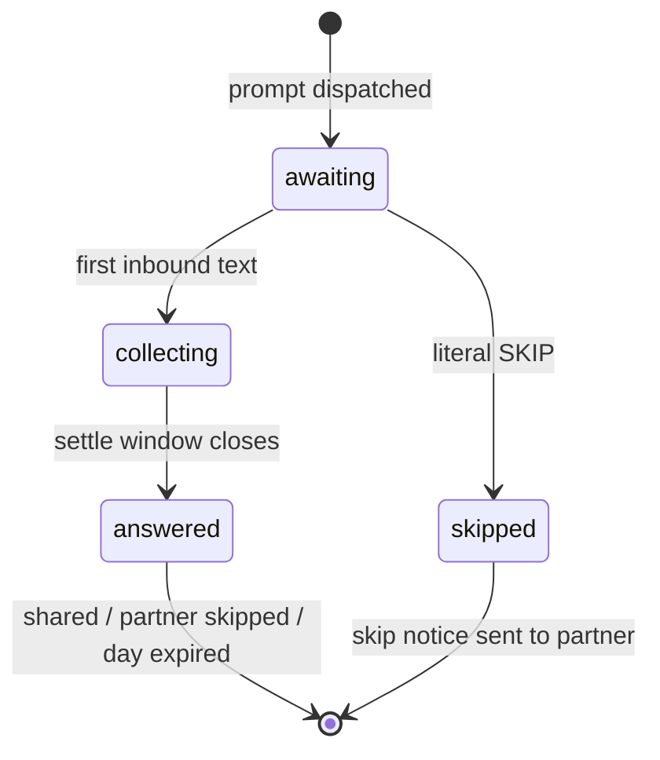

# Spec: Core Messaging Loop (System 1)

PRD: `prd-core-messaging-loop.md` · Parent: `prd-daily-imessage-checkin.md`

## Overview

Build the always-on daemon that runs the daily check-in ritual end to end with a static prompt bank: dispatch one prompt to two phone numbers at a configured time, collect settle-windowed responses, handle SKIP, share verbatim once both are in, capture feedback, and record everything in a SQLite ledger. Decisions locked with Aditya: **Photon Spectrum Cloud (free tier, shared line)** as the iMessage provider, **TypeScript + Bun** (bun:sqlite, bun test), **TDD throughout** (superpowers TDD skill: red before green for every feature). Spectrum's persistent gRPC stream carries inbound messages over an outbound connection, so there is **no webhook, no Tailscale Funnel, no public surface** — the PRD's F1 ingress requirements are satisfied by stream reconnection instead.

## Architecture

Greenfield repo; no existing code is touched. The design isolates all business logic in a pure, synchronous state machine driven by injected events and an injected clock, so TDD covers the product's actual complexity without any network or timers in tests.

```
src/
  index.ts                 # daemon entry: wire config + channel + ledger + engine + scheduler
  config.ts                # load/validate config.json + .env (zod)
  channel/
    types.ts               # Channel interface: send(person, text), inbound async iterable
    spectrum.ts            # spectrum-ts implementation (cloud mode, iMessage provider)
    fake.ts                # in-memory test double: scripted inbound, recorded outbound
  prompts/
    types.ts               # PromptSource interface: nextPrompt(date) -> {id, text}
    staticBank.ts          # seed bank + no-repeat tracking via ledger prompt_usage
  engine/
    stateMachine.ts        # pure reducer: (DayState, Event) -> (DayState, Effect[])
    settle.ts              # settle-window timers -> emits ResponseFinalized events
    copy.ts                # all outbound message templates (incl. SKIP instructions)
  ledger/
    db.ts                  # bun:sqlite open/migrate
    schema.sql             # tables below
    ledger.ts              # typed reads/writes; single source of truth
  scheduler.ts             # computes next dispatch instant from config tz; fires DispatchDue
data/prompts.json          # 30 seed prompts from docs/prompt-bank-seed.md
ops/com.dailyprompts.daemon.plist   # launchd KeepAlive job
tests/                     # bun test; mirrors src/
config.example.json, .env.example
```

Key boundaries (all from the PRD, now concrete; names below match the code as built):
- **`Channel`** — `send(personId, text): Promise<void>`; push-style `onMessage(handler)` for inbound `{person, text, at}`. `spectrum.ts` maps the two configured phone numbers to Spectrum *spaces* (its conversation concept) and filters everything else. `fake.ts` is the TDD workhorse.
- **`PromptSource`** — `staticBank.ts` in v0; System 3 later implements the same interface.
- **`stateMachine.ts`** — pure function, no I/O, no Date.now(). Events: `DispatchDue`, `InboundText`, `SettleElapsed` (day expiry is folded into the next `DispatchDue`; response finalization is the `SettleElapsed` outcome). Effects (returned, executed by `engine/runtime.ts`): `CreateDay`, `ResolveDay`, `Send`, `RecordInbound`, `StartSettle`, `SetCollecting`, `FinalizeResponse`, `MarkSkipped`. This is where both-answered gating, skip-forfeits-both-ways, feedback-window routing, and out-of-band handling live.
- **Sleep/wake**: Spectrum stream reconnect on wake; ledger day-state reconciliation on startup (e.g. dispatch missed → send late if still same calendar day, else mark failed). Empirical question SP-1 below covers whether Spectrum backfills messages received while disconnected.

## Data Model

SQLite via bun:sqlite, WAL mode, one file (`ledger.db`, path in config).

```sql
CREATE TABLE days (
  id INTEGER PRIMARY KEY,
  date TEXT NOT NULL UNIQUE,            -- YYYY-MM-DD in configured tz
  prompt_id TEXT NOT NULL,
  prompt_text TEXT NOT NULL,
  state TEXT NOT NULL,                  -- dispatched|resolved_shared|resolved_partial|resolved_skipped|expired|failed
  dispatched_at TEXT, resolved_at TEXT
);

CREATE TABLE person_days (
  day_id INTEGER NOT NULL REFERENCES days(id),
  person TEXT NOT NULL,                 -- 'a' | 'b' (mapped to config numbers)
  state TEXT NOT NULL,                  -- awaiting|collecting|answered|skipped
  response_text TEXT,                   -- finalized bundle (newline-joined)
  finalized_at TEXT,
  share_sent_at TEXT, feedback_ask_sent_at TEXT,
  PRIMARY KEY (day_id, person)
);

CREATE TABLE messages (                  -- every message in or out, verbatim
  id INTEGER PRIMARY KEY,
  day_id INTEGER REFERENCES days(id),   -- NULL for out-of-band/unattributable
  person TEXT,                          -- NULL for unknown senders (logged, dropped)
  direction TEXT NOT NULL,              -- in|out
  kind TEXT NOT NULL,                   -- prompt|answer_part|skip|waiting_notice|share|skip_notice|skip_ack|feedback_ask|feedback|oob_reply|oob_in|unknown_sender|send_failed
  text TEXT NOT NULL,
  at TEXT NOT NULL
);

CREATE TABLE prompt_usage (
  prompt_id TEXT PRIMARY KEY,
  used_on TEXT NOT NULL                 -- enforces no-repeat until bank exhausted
);
```

`person_days.state` transitions: `awaiting → collecting` (first inbound) `→ answered` (settle window closes) or `awaiting → skipped` (literal SKIP). Day resolves when both person_days are terminal, or expires at next dispatch.

## API / Server Actions

No HTTP surface at all. External contracts:

**Spectrum (outbound + stream)** — `spectrum-ts` package, cloud mode:
```ts
const app = await Spectrum({ projectId, projectSecret, platforms: [imessage.config()] });
for await (const [space, message] of app.messages) { /* → InboundMessage event */ }
await space.send(text);
```
Env: `PHOTON_PROJECT_ID`, `PHOTON_PROJECT_SECRET`. Exact API shapes verified against SDK docs in step 0 (they're from marketing docs, not yet exercised).

**Config (`config.json` + `.env`)**:
```jsonc
{
  "participants": { "a": {"name": "Aditya", "phone": "+1..."},
                    "b": {"name": "<partner>", "phone": "+1..."} },
  "dispatchTime": "08:30",
  "timezone": "America/Phoenix",
  "settleWindowSeconds": 150,
  "ledgerPath": "./ledger.db"
}
```

## Implementation Plan

TDD applies to every step: write the failing test first (bun test), then implement. Steps ordered so each is demoable.

**Step 0 — Spectrum spike (no TDD; throwaway)**
`spike/spectrum-hello.ts`: send a message to Aditya's phone from the shared line, echo one reply back, kill the process mid-conversation and restart to observe reconnect/backfill behavior. Answers SP-1/SP-2 before any real code depends on them.
✅ **Human Verification:** you received an iMessage from the Photon shared line on your phone; your reply showed up in the spike's stdout; note what the sender number/identity looked like and whether a message sent while the spike was dead arrived after restart. Approve or flag weirdness (esp. shared-line thread consistency) before proceeding.

**Step 1 — Repo scaffold + config loader (`src/config.ts`, `config.example.json`, `.env.example`)**
Bun init, strict tsconfig, zod-validated config load with clear errors on missing fields/secrets.
✅ **Human Verification:** `bun test` green; deliberately break a config field and confirm the error message tells you exactly what's wrong; commit contains no real phone numbers or secrets.

**Step 2 — Ledger (`src/ledger/*`)**
Migrations, typed writes/reads for days, person_days, messages, prompt_usage. Every write path unit-tested against a temp DB.
✅ **Human Verification:** `bun test` green; open `ledger.db` with `sqlite3` and eyeball that a seeded fake day round-trips (schema looks like the spec).

**Step 3 — Static prompt source (`src/prompts/*`, `data/prompts.json`)**
Port the 30 prompts from `docs/prompt-bank-seed.md`; no-repeat until exhaustion, then reshuffle; deterministic under injected RNG for tests.
✅ **Human Verification:** `bun test` green; run a tiny script printing 35 consecutive picks — confirm no repeats in the first 30 and sane behavior after.

**Step 4 — State machine (`src/engine/stateMachine.ts`, `copy.ts`) — the heart**
Pure reducer + all message copy. (A `[DP]` message prefix was briefly required while this project shared its Photon line with the sibling `networks` project; networks moved to its own Photon project on 2026-07-17, the line is exclusively ours, and the prefix was removed.) Test matrix (each a named test written first): happy path both answer → verbatim shares; first-responder waiting notice + feedback ask; SKIP exact-match semantics (case/whitespace, "skip please" is an answer); skip-forfeits-both-ways incl. prompt copy mentioning SKIP; both-skip; multi-part bundling via ResponseFinalized; post-settle trickle → feedback; feedback window until next dispatch; out-of-band canned reply (no open window); unknown sender dropped; day expiry on next DispatchDue; partial day never shared; idempotency (duplicate events are no-ops).
✅ **Human Verification:** review the test list against PRD F2–F6 edge cases and confirm nothing's missing; `bun test` green; read `copy.ts` and approve/edit the actual message wording (this is the product's voice — your call, not mine).

**Step 5 — Settle window (`src/engine/settle.ts`) + scheduler (`src/scheduler.ts`)**
Timer components with injected clocks: settle timer resets per inbound, fires ResponseFinalized after quiet gap; scheduler computes next dispatch instant in configured tz (DST-safe) and fires DispatchDue; startup reconciliation (missed dispatch same-day → late send; crossed midnight → expire + mark failed).
✅ **Human Verification:** `bun test` green including DST-transition test cases; confirm the reconciliation policy matches your intuition (late prompt same-day is OK?).

**Step 6 — Spectrum channel (`src/channel/spectrum.ts`) + daemon assembly (`src/index.ts`)**
Real channel behind the interface (mapping spaces ↔ configured numbers, dropping strangers), effect executor, wiring. Integration-tested with `fake.ts` end-to-end (full simulated day); Spectrum path covered by the spike learnings + a manual smoke.
✅ **Human Verification:** run the daemon with a dispatch time 2 minutes out and *your* number as both participants (or you + a willing friend): receive the prompt, answer in 2 texts, see the waiting notice + feedback ask, answer from the second number, receive shares. Then test SKIP for one side. Confirm the ledger rows match reality.

**Step 7 — launchd + ops (`ops/com.dailyprompts.daemon.plist`, README)**
KeepAlive daemon, log file locations, README covering self-host setup (Photon signup, config, launchd install) and the privacy disclosure (Photon + OpenRouter named; participants informed).
✅ **Human Verification:** reboot the Mac and confirm the daemon comes back without intervention; sleep the Mac through a dispatch time and confirm the reconciliation behavior; girlfriend has been told how it works before the first real day. 🎉 Then run the real thing for 2–3 days before building System 2.

## Mermaid Diagrams

### Happy-path day


### Person-day states


## Open Questions

All four spike questions were resolved by step 0 (run 2026-07-17):

1. ~~SP-1 backfill~~ — **confirmed**: a message sent while the process was dead was delivered on the next connection. Mac sleep = delayed processing, no loss, no poll needed.
2. ~~SP-2 shared line~~ — **confirmed**: sender appears as a proper phone number, consistent thread across process restarts. Cross-project routing risk was eliminated on 2026-07-17: the sibling `networks` project moved to its own Photon project/credentials, so this line and these credentials are exclusively daily-prompts'.
3. ~~API fidelity~~ — **confirmed with corrections**: package is `spectrum-ts` v11 (`@spectrum-ts/core` + `@spectrum-ts/imessage`); env vars named `SPECTRUM_PROJECT_ID`/`SPECTRUM_PROJECT_SECRET`; initiation via `imessage(app).space.create("+1...")`; inbound text is `message.content.type === "text" ? message.content.text : undefined` (receipts/reactions arrive as other content types and must be ignored); iterate `app.messages` as `[space, message]`.
4. ~~Self-messaging~~ — **confirmed**: Aditya as recipient works normally.
