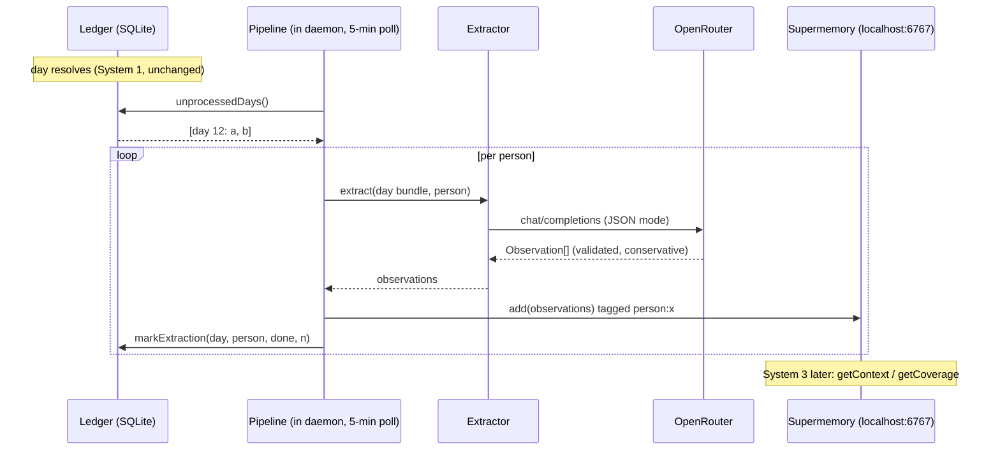

# Spec: Memory & Ontology Pipeline (System 2)

PRD: `prd-memory-ontology.md` · Parent: `prd-daily-imessage-checkin.md` · Depends on System 1 (live since 2026-07-18)

## Overview

Turn each resolved day in the System 1 ledger into durable, structured, per-person knowledge. A pipeline inside the existing daemon watches the ledger for resolved days that haven't been processed, runs one conservative LLM extraction call per person per day (OpenRouter, cheap tier), and writes typed observations into **self-hosted Supermemory** running on this Mac as a second launchd service (`supermemory-server`, port 6767, API-identical to their cloud; validated against official docs 2026-07-19). Everything goes through a `Memory` interface so the backend stays swappable, extraction is idempotent and replayable from the ledger, and System 3 gets exactly two retrieval calls: `getContext(person)` and `getCoverage(person)`. Decisions locked with Aditya: in-daemon topology, self-hosted Supermemory, model my pick as a config default. TDD throughout.

## Architecture

New modules; zero changes to the state machine, runtime, or channel. The core loop still doesn't know System 2 exists — the only integration point is a poller wired up in `index.ts`.

```
src/
  llm/openrouter.ts        # minimal chat-completions client (fetch), model from config
  memory/
    types.ts               # Observation, Memory interface: add/getContext/getCoverage/wipe
    supermemory.ts         # HTTP client for localhost:6767 (/v3/documents, /v4/search)
    fake.ts                # in-memory Memory for tests
  extraction/
    extractor.ts           # (day bundle, person) -> Observation[] via one LLM call
    pipeline.ts            # scan ledger for unprocessed resolved days; extract; write; mark
scripts/rebuild-memory.ts  # wipe memory + reprocess entire ledger (PRD F5)
ops/com.dailyprompts.supermemory.plist  # launchd job for supermemory-server
```

- **Poller integration** (`index.ts`): every 5 minutes (and once at startup), call `pipeline.processPending()`. No event coupling to the runtime; the ledger is the contract.
- **Isolation on failure**: an extraction failure marks the day `failed` with a retry count and never blocks later days (retried up to 3 times on subsequent polls, then left for `rebuild`).
- **Supermemory's own LLM**: the server needs an OpenAI-compatible endpoint for its internal profile/graph features; its launchd job sets `OPENAI_BASE_URL=https://openrouter.ai/api/v1` with the same OpenRouter key.
- **Privacy**: raw day content goes to OpenRouter (already an accepted party) for extraction; derived observations stay on this Mac inside self-hosted Supermemory. No new parties.

## Data Model

**Ledger addition** (migration in `schema.sql`, additive only):

```sql
CREATE TABLE IF NOT EXISTS extractions (
  day_id INTEGER NOT NULL REFERENCES days(id),
  person TEXT NOT NULL CHECK (person IN ('a','b')),
  status TEXT NOT NULL CHECK (status IN ('done','failed')),
  attempts INTEGER NOT NULL DEFAULT 1,
  observation_count INTEGER,
  completed_at TEXT,
  PRIMARY KEY (day_id, person)
);
```

**Observation** (the unit written to memory):

```ts
interface Observation {
  type: "fact" | "thread" | "interest" | "mood_signal" | "prompt_preference";
  text: string;            // hedged, conservative phrasing
  topic: string;           // short kebab-case topic tag, feeds getCoverage
  person: PersonId;
  provenance: { dayId: number; date: string; snippet: string };
}
```

Stored in Supermemory as one document per observation, container-tagged `person:{a|b}` (hard isolation between the two people), with `type`, `topic`, `date` as metadata. `mood_signal`s carry their date so retrieval can recency-weight them; contradictions are kept, both dated (decay is retrieval's problem, per PRD).

## API / Server Actions

No HTTP surface of ours. External contracts:

**`Memory` interface** (the only System 3 coupling surface, PRD F4):
```ts
interface Memory {
  add(observations: Observation[]): Promise<void>;
  getContext(person: PersonId, budget?: number): Promise<PersonContext>; // {facts, threads, interests, recentMoods, promptPreferences} — compact strings, newest-first, capped by budget
  getCoverage(person: PersonId): Promise<string[]>;                      // distinct topic tags seen so far
  wipe(person: PersonId): Promise<void>;                                 // rebuild support
}
```

**Supermemory** (self-hosted): `POST /v3/documents` (add, containerTags + metadata), `POST /v4/search` (filtered by containerTag/metadata; exact filter capabilities validated in step 1). Auth: `SUPERMEMORY_API_KEY` printed by the server on first boot. `SUPERMEMORY_BASE_URL` default `http://localhost:6767`.

**OpenRouter**: `POST /v1/chat/completions`, model from config `extraction.model`, default **`google/gemini-2.5-flash`** (cheap, fast, JSON-reliable; swappable in config). Env: `OPENROUTER_API_KEY`.

**Config additions** (`config.json` + `.env`): `extraction: { model, pollMinutes }` with defaults; new env keys `OPENROUTER_API_KEY`, `SUPERMEMORY_API_KEY`, optional `SUPERMEMORY_BASE_URL`.

## Implementation Plan

**Step 1 — Supermemory spike (throwaway, answers the PRD's maturity question)**
Install `supermemory-server` on the Mac, boot it, capture the printed API key, and from a scratch script: add 3 tagged documents, search them back filtered by container tag and metadata, wipe. Note memory/CPU footprint and cold-boot time.
✅ **Human Verification:** paste your `OPENROUTER_API_KEY` into `.env` first (server needs it). Confirm the server boots, the round-trip works, and the footprint is acceptable to leave running on your Mac permanently. This is the go/no-go for self-hosted; if it disappoints, we fall back per PRD (hosted Supermemory or Mem0) before any real code.

**Step 2 — Config + ledger migration (TDD)**
Extend `src/config.ts` (new env keys, `extraction` block with defaults) and `schema.sql` (+`extractions` table, additive; existing prod `ledger.db` picks it up via `CREATE TABLE IF NOT EXISTS`). Ledger methods: `unprocessedDays(person?)`, `markExtraction(dayId, person, status, count)`, `extractionFor(dayId, person)`.
✅ **Human Verification:** `bun test` green; run the daemon locally against a copy of prod `ledger.db` and confirm the migration applies cleanly without touching existing rows.

**Step 3 — OpenRouter client + extractor (TDD with fake LLM)**
`src/llm/openrouter.ts` (thin, typed, JSON-mode). `src/extraction/extractor.ts`: builds the per-person extraction prompt (day's prompt text, their response or skip, their feedback since last prompt), demands strict JSON `Observation[]`, validates with zod, drops malformed items rather than failing the batch, enforces conservative phrasing rules in the system prompt (no invented facts; hedge or drop uncertain readings; every observation carries a verbatim snippet).
✅ **Human Verification:** review the extraction system prompt (it defines what gets remembered about you two — your call, like copy.ts was); then one real extraction run against yesterday's actual resolved day, and you sanity-check the observations it produces for accuracy and tone.

**Step 4 — Supermemory Memory implementation (TDD against fake + live smoke)**
`src/memory/types.ts`, `fake.ts`, `supermemory.ts` (add/getContext/getCoverage/wipe mapped to the endpoints, shapes per step 1 findings). `getContext` composes the five buckets with newest-first mood signals and a char budget.
✅ **Human Verification:** live smoke against your running server: add observations from step 3's real run, then eyeball `getContext("a")` / `getCoverage("a")` output for sanity.

**Step 5 — Pipeline + daemon wiring (TDD with fakes)**
`src/extraction/pipeline.ts` (scan → extract → write → mark; per-person; retry caps; failure isolation). Wire the 5-minute poller + startup catch-up into `index.ts`. Add `ops/com.dailyprompts.supermemory.plist` and README updates (new service, new env keys, privacy note gains "extraction transits OpenRouter").
✅ **Human Verification:** restart the daemon; confirm the two backlog days (07-18 test day, 07-19 real day) get extracted on startup catch-up, `extractions` rows appear, and observations land in Supermemory. Reboot test: both launchd services come back.

**Step 6 — Rebuild script (TDD)**
`scripts/rebuild-memory.ts`: wipe both persons' containers, clear `extractions`, reprocess the full ledger; idempotent re-runs.
✅ **Human Verification:** run it twice back-to-back; confirm observation counts identical (no duplication) and spot-check a rebuilt observation's provenance.

**Step 7 — Soak + commit**
Let it run across 2-3 real days.
✅ **Human Verification:** after a few mornings, read `getContext` for yourself and confirm it feels accurate and non-creepy; then we commit/push System 2 and System 3 becomes unblocked.

## Mermaid Diagrams



## Open Questions

1. **Supermemory search filter fidelity** (step 1): whether `/v4/search` filters cleanly by containerTag + metadata type, or `getContext` needs client-side filtering over a broader fetch.
2. **Context budget defaults** (step 4/7): how much context is warm vs creepy — tuned during the soak, config-adjustable.
3. **Coverage fidelity**: v0 coverage = distinct topic tags from observations. Embedding-cluster coverage is a System 3/eval-harness upgrade.
4. **Skip/expired-day signal**: v0 extracts from skips/feedback on such days but writes no synthetic "they skipped" observation; revisit if skip patterns feel meaningful.
